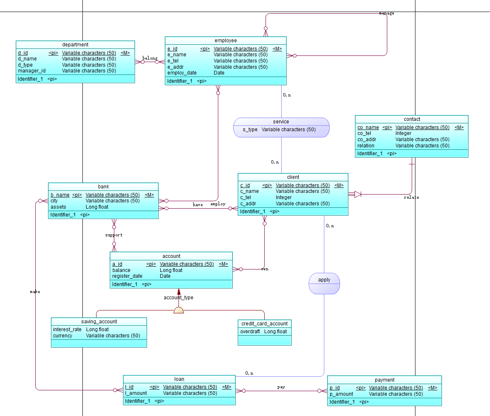
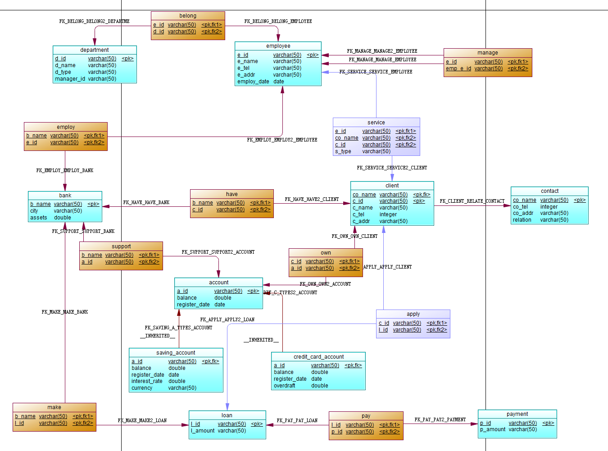

# 银行业务管理系统数据库设计 

PB22111599 杨映川

## 1 概念模型设计

### 1.1 实体设计

> //阐述每一个实体的设计结果和理由 
>
> 实体：（primary identifier），其他属性

- Bank: (b_name), city, assets
- Client: (c_id), c_name, c_tel, c_addr
- Contact: (c_id, co_name), co_tel, co_email, relation
- Account: (a_id), balance, register_date, b_name
- Saving_Account: (a_id), interest_rate, currency
- Credit_Card_Account: (a_id), overdraft
- Loan: (l_id), l_amount, b_name
- Employee: (e_id), e_name, e_tel, e_addr, d_id, employ_date
- Department: (d_id), d_name, d_type, manager_id
- Payment: (l_id, c_id), p_amount, p_date

### 1.2 联系设计 

> //阐述每一个联系的设计结果和理由 
>
> 实体a-(X, Y)-关系-(M, N)-实体b

- Bank -(0, N)- 开存钱账户 -(1, 1)- Saving_Account
  - 支行可以开多个存钱账户，但一个存钱账户仅有一个对应的支行

- Bank -(0, N)- 开信用卡账户 -(1, 1)- Credit_Card_Account
  - 支行可以开多个信用卡账户，但一个信用卡账户仅有一个对应的支行

- Bank -(1, N)- 部门从属 -(1, 1)- Department
  - 支行至少有一个部门，一个部门仅从属于一个支行

- Bank -(0, N)- 发放贷款 -(1, 1)- Loan
  - 支行可以发放多笔贷款，但每一笔贷款仅从属于一个支行

- Employee -(1, 1)- 工作于 -(1, N)- Department
  - 员工只能工作在一个部门，一个部门至少有一个员工
- Employee -(1, 1)- 部门管理 -(1, 1)- Department
  - 部门经理也属于员工，只能管理一个部门，同时一个部门必须有一个部门经理
- Client -(0, N)- 贷款关系 -(1, N)- Loan
  - 客户可以有多笔贷款，但一笔贷款必须至少有一个申请的客户
- Loan -(0, N)- 支付贷款 -(1, 1)- Payment
  - 一笔贷款可以有多个支付情况，但每一个支付情况必须对应一笔贷款
- Client -(0, N)- 拥有账户 -(1, 1)- Account
  - 客户可以拥有多个账户，但一个账户必须属于一个客户
- Employee -(0, N)- 服务（类型） -(0, N)- Client
  - 一个员工可以是贷款负责人也可以是银行账户负责人，同时一个员工可以负责多个客户

### 1.3 Power Designer 的 ER 图 

> //把 CDM 设计得到的 ER 图放到这一节 

## 2 概念模型到逻辑模型的转换 

### 2.1 实体转换 

> 实体, (primary key), 其他attributes

- Bank → 表 Bank，主键：b_name，其他属性：city、assets
- Client → 表 Client，主键：c_id，其他属性：c_name、c_tel、c_addr
- Contact → 表 Contact，复合主键：c_id + co_name，其他属性：co_tel、co_email、relation
- Account → 表 Account，主键：a_id，其他属性：balance、register_date、b_name
- Saving_Account → 表 Saving_Account，主键：a_id，其他属性：interest_rate、currency
- Credit_Card_Account → 表 Credit_Card_Account，主键：a_id，其他属性：overdraft
- Loan → 表 Loan，主键：l_id，其他属性：l_amount、b_name
- Employee → 表 Employee，主键：e_id，其他属性：e_name、e_tel、e_addr、d_id、employ_date
- Department → 表 Department，主键：d_id，其他属性：d_name、d_type、manager_id
- Payment → 表 Payment，复合主键：l_id + c_id，其他属性：p_amount、p_date

### 2.2 联系转换 

- Bank-开存钱账户-Saving_Account
  - 在 Saving_Account 表中添加外键列 b_name
- Bank-开信用卡账户-Credit_Card_Account
  - 在 Credit_Card_Account 表中添加外键列 b_name
- Bank-部门-Department
  - 在 Department 表中添加外键列 b_name
- Bank-发放贷款-Loan
  - 在 Loan 表中添加外键列 b_name
- Client-拥有账户-Account
  - 因为是多对多关系，需要新建关联表 Client_Account，记录 c_id 与 a_id 的配对，以及 last_visited_date
- Client-申请贷款-Loan
  - 因为是多对多关系，需要新建关联表 Client_Loan，记录 c_id 与 l_id 的配对
- Loan-支付贷款-Payment
  - 在 Payment 表中添加外键列 l_id
- Client-关联-Contact
  - 在 Contact 表中添加外键列 c_id
- Employee-工作于-Department
  - 在 Employee 表中添加外键列 d_id
- 部门经理-管理-Department
  - 在 Department 表中添加外键列 manager_id
- Employee-服务-Client
  - 因为是带属性的多对多关系（有“类型”属性），需要新建关联表 Employee_Client_Service，记录 e_id、c_id 和 service_type。

### 2.3 最终的关系模式 

- Bank(b_name PK, city, assets)
- Client(c_id PK, c_name, c_tel, c_addr)
- Contact(c_id PK, co_name PK, co_tel, co_email, relation, c_id → Client)
- Account(a_id PK, balance, register_date, b_name → Bank)
- Saving_Account(a_id PK → Account, interest_rate, currency)
- Credit_Card_Account(a_id PK → Account, overdraft)
- Loan(l_id PK, l_amount, b_name → Bank)
- Employee(e_id PK, e_name, e_tel, e_addr, d_id → Department, employ_date)
- Department(d_id PK, d_name, d_type, manager_id → Employee, b_name → Bank)
- Payment(l_id PK, c_id PK, p_amount, p_date, l_id → Loan, c_id → Client)
- Client_Account(c_id PK, a_id PK, last_visited_date, c_id → Client, a_id → Account)
- Client_Loan(c_id PK, l_id PK, c_id → Client, l_id → Loan)
- Employee_Client_Responsibility(e_id PK, c_id PK, responsibility_type, e_id → Employee, c_id → Client)

## 3 MySQL 数据库结构实现 

### 3.1 Power Designer 的 PDM 图 

>  //把 PD 得到的物理数据模型图放到这里 

### 3.2 数据库表定义 

>  //给出各个 Table 的定义 

表 1. 支行表 (Bank)

| 列名   | 中文含义 | 类型(长度) | 允许为空 (Null) | 是否主键 (Primary Key) | 是否外键 (若是则给出引用的表和列名) |
| ------ | -------- | ---------- | --------------- | ---------------------- | ----------------------------------- |
| b_name | 支行名称 | CHAR(50)   | 否              | 是                     | 否                                  |
| city   | 城市     | CHAR(50)   | 是              | 否                     | 否                                  |
| assets | 资产     | DOUBLE     | 是              | 否                     | 否                                  |

表 2. 客户表 (Client)

| 列名   | 中文含义 | 类型(长度)   | 允许为空 (Null) | 是否主键 (Primary Key) | 是否外键 (若是则给出引用的表和列名) |
| ------ | -------- | ------------ | --------------- | ---------------------- | ----------------------------------- |
| c_id   | 客户编号 | CHAR(50)     | 否              | 是                     | 否                                  |
| c_name | 客户姓名 | CHAR(50)     | 是              | 否                     | 否                                  |
| c_tel  | 客户电话 | INT          | 是              | 否                     | 否                                  |
| c_addr | 客户地址 | VARCHAR(255) | 是              | 否                     | 否                                  |

表 3. 联系人表 (Contact)

| 列名     | 中文含义   | 类型(长度) | 允许为空 (Null) | 是否主键 (Primary Key) | 是否外键 (若是则给出引用的表和列名) |
| -------- | ---------- | ---------- | --------------- | ---------------------- | ----------------------------------- |
| c_id     | 客户编号   | CHAR(50)   | 否              | 是                     | 引用 Client(c_id)                   |
| co_name  | 联系人姓名 | CHAR(50)   | 否              | 是                     | 否                                  |
| co_tel   | 联系人电话 | INT        | 是              | 否                     | 否                                  |
| co_email | 联系人邮箱 | CHAR(50)   | 是              | 否                     | 否                                  |
| relation | 与客户关系 | CHAR(50)   | 是              | 否                     | 否                                  |

表 4. 账户表 (Account)

| 列名          | 中文含义 | 类型(长度) | 允许为空 (Null) | 是否主键 (Primary Key) | 是否外键 (若是则给出引用的表和列名) |
| ------------- | -------- | ---------- | --------------- | ---------------------- | ----------------------------------- |
| a_id          | 账户编号 | CHAR(50)   | 否              | 是                     | 否                                  |
| balance       | 余额     | DOUBLE     | 是              | 否                     | 否                                  |
| register_date | 注册日期 | DATE       | 是              | 否                     | 否                                  |
| b_name        | 支行名称 | CHAR(50)   | 否              | 否                     | 引用 Bank(b_name)                   |

表 5. 存钱账户表 (Saving_Account)

| 列名          | 中文含义 | 类型(长度) | 允许为空 (Null) | 是否主键 (Primary Key) | 是否外键 (若是则给出引用的表和列名) |
| ------------- | -------- | ---------- | --------------- | ---------------------- | ----------------------------------- |
| a_id          | 账户编号 | CHAR(50)   | 否              | 是                     | 引用 Account(a_id)                  |
| interest_rate | 利率     | DOUBLE     | 是              | 否                     | 否                                  |
| currency      | 币种     | CHAR(50)   | 是              | 否                     | 否                                  |

表 6. 信用卡账户表 (Credit_Card_Account)

| 列名      | 中文含义 | 类型(长度) | 允许为空 (Null) | 是否主键 (Primary Key) | 是否外键 (若是则给出引用的表和列名) |
| --------- | -------- | ---------- | --------------- | ---------------------- | ----------------------------------- |
| a_id      | 账户编号 | CHAR(50)   | 否              | 是                     | 引用 Account(a_id)                  |
| overdraft | 透支额度 | DOUBLE     | 是              | 否                     | 否                                  |

表 7. 贷款表 (Loan)

| 列名     | 中文含义 | 类型(长度) | 允许为空 (Null) | 是否主键 (Primary Key) | 是否外键 (若是则给出引用的表和列名) |
| -------- | -------- | ---------- | --------------- | ---------------------- | ----------------------------------- |
| l_id     | 贷款编号 | CHAR(50)   | 否              | 是                     | 否                                  |
| l_amount | 贷款金额 | DOUBLE     | 是              | 否                     | 否                                  |
| b_name   | 支行名称 | CHAR(50)   | 否              | 否                     | 引用 Bank(b_name)                   |

表 8. 员工表 (Employee)

| 列名        | 中文含义 | 类型(长度)   | 允许为空 (Null) | 是否主键 (Primary Key) | 是否外键 (若是则给出引用的表和列名) |
| ----------- | -------- | ------------ | --------------- | ---------------------- | ----------------------------------- |
| e_id        | 员工编号 | CHAR(50)     | 否              | 是                     | 否                                  |
| e_name      | 员工姓名 | CHAR(50)     | 是              | 否                     | 否                                  |
| e_tel       | 员工电话 | INT          | 是              | 否                     | 否                                  |
| e_addr      | 员工地址 | VARCHAR(255) | 是              | 否                     | 否                                  |
| d_id        | 部门编号 | CHAR(50)     | 否              | 否                     | 引用 Department(d_id)               |
| employ_date | 雇佣日期 | DATE         | 是              | 否                     | 否                                  |

表 9. 部门表 (Department)

| 列名       | 中文含义 | 类型(长度) | 允许为空 (Null) | 是否主键 (Primary Key) | 是否外键 (若是则给出引用的表和列名) |
| ---------- | -------- | ---------- | --------------- | ---------------------- | ----------------------------------- |
| d_id       | 部门编号 | CHAR(50)   | 否              | 是                     | 否                                  |
| d_name     | 部门名称 | CHAR(50)   | 是              | 否                     | 否                                  |
| d_type     | 部门类型 | CHAR(50)   | 是              | 否                     | 否                                  |
| manager_id | 经理编号 | CHAR(50)   | 是              | 否                     | 引用 Employee(e_id)                 |

表 10. 还款表 (Payment)

| 列名     | 中文含义 | 类型(长度) | 允许为空 (Null) | 是否主键 (Primary Key) | 是否外键 (若是则给出引用的表和列名) |
| -------- | -------- | ---------- | --------------- | ---------------------- | ----------------------------------- |
| l_id     | 贷款编号 | CHAR(50)   | 否              | 是                     | 引用 Loan(l_id)                     |
| c_id     | 客户编号 | CHAR(50)   | 否              | 是                     | 引用 Client(c_id)                   |
| p_amount | 还款金额 | DOUBLE     | 是              | 否                     | 否                                  |
| p_date   | 还款日期 | DATE       | 是              | 否                     | 否                                  |

## 4 总结与体会 

> //总结自己的设计工作。如果有经验或者体会，可以在这里给出。 

1. PowerDesigner功能较多且设计复杂，学习使用过程中有一点上手难度（希望以后实验文档可以附带一点PowerDesigner使用教程
2. 数据库设计不唯一，但如果不仔细检查和删改会出现较多冗余的设计